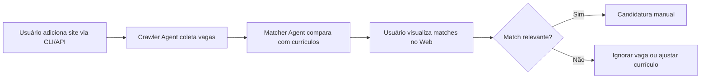

# OpenCode VagAI - Especificação do Projeto

## Visão Geral
Sistema CLI + API + Web para busca automatizada de vagas de trabalho em múltiplos sites, com matching inteligente baseado em currículos armazenados.

## Arquitetura de Agentes (Agentic Design)

O sistema utiliza **3 agentes especializados** que se comunicam via banco de dados:

| Agente            | Responsabilidade                                    | Autonomia                              |
| ----------------- | --------------------------------------------------- | -------------------------------------- |
| **Crawler Agent** | Navega sites, extrai links e descrições de vagas    | Alta (execução periódica)              |
| **Matcher Agent** | Compara vagas com currículos (similaridade textual) | Média (requer validação de thresholds) |
| **API Agent**     | Expõe dados via REST e gerencia consultas           | Baixa (sob demanda do usuário)         |

---

## Estrutura de Pastas do Projeto

```
opencode-vagai/
│
├── vagai-cli/          # CLI + agentes de coleta e matching
│   ├── cmd/
│   │   ├── crawl/          # comando para iniciar crawlers
│   │   ├── match/          # comando para rodar matching
│   │   └── root.go         # comando principal
│   ├── internal/
│   │   ├── agents/
│   │   │   ├── crawler/    # Crawler Agent
│   │   │   ├── matcher/    # Matcher Agent
│   │   │   └── registry/   # registro de sites e currículos
│   │   ├── db/             # conexão MySQL (GORM/sqlx)
│   │   └── models/         # structs compartilhadas
│   ├── configs/
│   │   ├── sites.yaml      # lista de sites a monitorar
│   │   └── resumes.yaml    # referência aos currículos
│   ├── go.mod
│   └── main.go
│
├── vagai-api/          # API REST (Gin/Echo)
│   ├── cmd/
│   │   └── server/         # entrypoint da API
│   ├── internal/
│   │   ├── handlers/       # endpoints HTTP
│   │   ├── services/       # lógica de consulta
│   │   └── repository/     # acesso ao MySQL
│   ├── docs/               # Swagger/OpenAPI
│   ├── go.mod
│   └── main.go
│
├── vagai-web/          # Frontend React/Vue para visualização
│   ├── src/
│   │   ├── components/     # tabelas, filtros, gráficos
│   │   ├── pages/          # Dashboard, Vagas, Matches
│   │   ├── services/       # chamadas à API
│   │   └── App.jsx
│   ├── public/
│   ├── package.json
│   └── vite.config.js
│
├── docker-compose.yml       # sobe MySQL + (opcional) API + Web
├── schema.sql               # script de criação do banco
└── README.md
```

---

## Banco de Dados (MySQL)

### Tabelas principais

```sql
-- Sites monitorados
CREATE TABLE sites (
    id INT PRIMARY KEY AUTO_INCREMENT,
    name VARCHAR(100) NOT NULL,
    url VARCHAR(500) NOT NULL,
    selector_links VARCHAR(255),   -- seletor CSS para links de vagas
    active BOOLEAN DEFAULT TRUE,
    last_crawl DATETIME
);

-- Vagas encontradas
CREATE TABLE jobs (
    id INT PRIMARY KEY AUTO_INCREMENT,
    site_id INT,
    title VARCHAR(255),
    company VARCHAR(255),
    description TEXT,
    url VARCHAR(500) UNIQUE,
    posted_date DATE,
    collected_at DATETIME DEFAULT CURRENT_TIMESTAMP,
    status ENUM('new', 'matched', 'ignored') DEFAULT 'new',
    FOREIGN KEY (site_id) REFERENCES sites(id)
);

-- Currículos (versões)
CREATE TABLE resumes (
    id INT PRIMARY KEY AUTO_INCREMENT,
    name VARCHAR(100),
    file_path VARCHAR(500),
    content TEXT,               -- texto extraído (PDF/TXT/DOCX)
    version INT,
    uploaded_at DATETIME
);

-- Matches (resultado da comparação)
CREATE TABLE matches (
    id INT PRIMARY KEY AUTO_INCREMENT,
    job_id INT,
    resume_id INT,
    similarity_score DECIMAL(5,2), -- 0 a 100
    keywords_matched JSON,          -- ex: ["Python", "Kafka"]
    ai_reason TEXT,                 -- análise da IA (opcional)
    analyzed_at DATETIME,
    FOREIGN KEY (job_id) REFERENCES jobs(id),
    FOREIGN KEY (resume_id) REFERENCES resumes(id)
);

-- Logs dos agentes (rastreabilidade)
CREATE TABLE agent_logs (
    id INT PRIMARY KEY AUTO_INCREMENT,
    agent_name VARCHAR(50),
    action VARCHAR(255),
    details JSON,
    created_at DATETIME DEFAULT CURRENT_TIMESTAMP
);
```

---

## Especificação dos Agentes

### 1. Crawler Agent (vagai-cli)

**Comportamento:**
- Lê `configs/sites.yaml` (adição dinâmica de novos sites)
- Para cada site ativo:
  - Baixa HTML (com User-Agent rotativo, delay respeitoso)
  - Extrai links de vagas via CSS selector ou regex
  - Para cada link, baixa página da vaga e extrai título, empresa, descrição
  - Insere/atualiza na tabela `jobs` (evita duplicatas por URL)

**Crawlers especiais:**
- **RemoteOK:** Usa API JSON em `https://remoteok.com/api`
- **Working Nomads:** Usa API JSON em `https://www.workingnomads.com/api/exposed_jobs/`

**Ferramentas integradas:**
- HTTP client com timeout e retry
- Parsers: `goquery` (HTML), `colly` (crawling)
- Rate limiter configurável (ex: 1 req/segundo)

**Comandos CLI:**
```bash
# Executa crawl de todos os sites ativos
vagai crawl --all

# Crawl apenas um site específico
vagai crawl --site "linkedin"

# Adiciona novo site via CLI
vagai sites add --name "remoteok" --url "https://remoteok.com" --selector ".job-link"
```

### 2. Matcher Agent (vagai-cli)

**Comportamento:**
- Carrega todos os currículos da tabela `resumes`
- Para vagas com status `'new'` de sites ativos:
  - Calcula similaridade TF-IDF + cosine similarity (ou embeddings via sentence-transformers)
  - Extrai palavras-chave em comum
  - Registra score e keywords no `matches`
  - Se score > limiar (ex: 60), marca job como `'matched'`
- **Filtro automático:** Ignora vagas de sites com `active = false`

**Estratégia de matching:**
```go
score = (0.6 * similaridade_textual) + (0.3 * overlap_skills) + (0.1 * match_localizacao)
```

**Comandos CLI:**
```bash
# Roda matching para vagas novas
vagai match --run

# Força rematch para todas as vagas
vagai match --force

# Define threshold de score (padrão 60)
vagai match --threshold 70
```

### 3. API Agent (vagai-api)

**Endpoints REST:**

| Método | Rota                  | Descrição                                        |
| ------ | --------------------- | ------------------------------------------------ |
| GET    | `/api/jobs`           | Lista vagas (com filtros: site, status, data)    |
| GET    | `/api/jobs/:id`       | Detalhe de uma vaga + matches                    |
| GET    | `/api/matches`        | Lista matches (params: threshold, sort)          |
| GET    | `/api/stats`          | Estatísticas: total vagas, matches, sites ativos, linguagens e tecnologias mais requisitadas |
| GET    | `/api/sites`          | Lista sites monitorados                          |
| POST   | `/api/sites`          | Adiciona novo site                               |
| GET    | `/api/resumes`        | Lista currículos cadastrados                     |
| POST   | `/api/resumes/upload` | Faz upload de novo currículo (PDF/DOCX/TXT)      |

**Autenticação:** (opcional) API Key via header `X-API-Key`

---

## Frontend Web (vagai-web)

### Páginas principais

1. **Dashboard**  
   - Cards com KPIs: total vagas, matches, sites monitorados  
   - Gráfico de vagas por dia (Chart.js)  
   - Últimos matches com score alto

2. **Vagas**  
   - Tabela paginada com título, empresa, site, status  
   - Filtros por site, status, data  
   - Botão "Ver match" para vagas com score > threshold

3. **Matches**  
   - Lista de correspondências ordenadas por score decrescente  
   - Exibe palavras-chave em comum  
   - Link direto para vaga original

4. **Configurações**  
   - Formulário para adicionar novo site (nome, URL, seletor)  
   - Upload de currículo (drag-and-drop)

### Tecnologias sugeridas
- React + Vite + TailwindCSS
- Axios para API
- React Query para cache e refetch

---

## Fluxo de Trabalho (Usuário Final)



---

## Configuração Inicial (YAMLs)

### `vagai-cli/configs/sites.yaml`
```yaml
sites:
  - name: "RemoteOK"
    url: "https://remoteok.com"
    selector_links: "td.company a"
    active: true
    respect_robots: true
    delay_seconds: 2

  - name: "WeWorkRemotely"
    url: "https://weworkremotely.com"
    selector_links: ".jobs li a"
    active: true
    delay_seconds: 1

  - name: "Working Nomads"
    url: "https://www.workingnomads.com/jobs"
    selector_links: "a.job-link"
    active: true
    delay_seconds: 1
```

### `vagai-cli/configs/resumes.yaml`
```yaml
resumes:
  - name: "backend_developer.pdf"
    path: "./curriculos/backend.pdf"
    version: 3
  - name: "data_engineer.pdf"
    path: "./curriculos/data_eng.pdf"
    version: 1
```

---

## Comandos Docker para Subir o Ambiente

```bash
# Subir apenas MySQL
docker-compose up -d mysql

# Subir tudo (API + Web + DB)
docker-compose up -d

# Executar CLI dentro do container
docker exec -it vagai-cli vagai crawl --all
docker exec -it vagai-cli vagai match --run
```

### `docker-compose.yml` (resumo)
```yaml
services:
  mysql:
    image: mysql:8
    environment:
      MYSQL_ROOT_PASSWORD: root
      MYSQL_DATABASE: vagai
    ports:
      - "3306:3306"
  
  api:
    build: ./vagai-api
    ports:
      - "8080:8080"
    depends_on:
      - mysql
  
  web:
    build: ./vagai-web
    ports:
      - "3000:80"
```

---

## Progresso da Implementação

### Sprint 0: Concluído ✅
- Estrutura de pastas criada
- `go.mod` configurado com cobra, goquery, gorm
- CLI compilável

### Sprint 1: Concluído ✅
- CLI conectado ao MySQL via GORM
- Tabelas criadas via AutoMigrate
- Comandos: `crawl`, `match`, `sites`

### Sprint 2: Concluído ✅
- Crawler Agent implementado com goquery
- Suporte a múltiplos sites via configuração
- Extração de links de vagas

### Sprint 3: Concluído ✅
- Matcher Agent implementado
- Similaridade textual + overlap de palavras-chave
- Score configurável com threshold

### Sprint 4: Concluído ✅
- API REST com Gin
- Endpoints: `/api/jobs`, `/api/matches`, `/api/stats`, `/api/sites`, `/api/resumes`

### Sprint 5: Concluído ✅
- Frontend Vue 3 + TanStack Query + TailwindCSS
- Páginas: Dashboard, Vagas, Matches, Configurações

### Sprint 6: Concluído ✅
- Integração com LM Studio para embeddings
- Fallback automático para método tradicional

### Sprint 7: Concluído ✅
- Scheduler com robfig/cron
- Comandos: `schedule add`, `schedule list`, `schedule remove`, `schedule run`
- Persistência no banco

### Sprint 8: Concluído ✅
- Matching com IA usando LM Studio (chat completion)
- Campo `ai_reason` para explicação da análise
- Ordenação por similaridade na API e Web
- Correção do seletor do WeWorkRemotely
- Comando `delete` para limpar dados
- Docker Compose com `extra_hosts` para LM Studio

### Sprint 9: Concluído ✅
- Dashboard com análises e gráficos
- Estatísticas de linguagens mais requisitadas (top 10)
- Estatísticas de tecnologias mais requisitadas (top 10)
- Barras de progresso visuais no frontend

---

## Comandos CLI

### Crawler
```bash
vagai crawl --all           # Executa crawl em todos os sites ativos
vagai crawl --site <nome>   # Executa crawl em site específico
```

### Matcher
```bash
vagai match --run                  # Executa matching com threshold padrão (65)
vagai match --threshold 70         # Customiza threshold
vagai match --force                # Força re-matching de todas as vagas
```

### Sites
```bash
vagai sites add --name <nome> --url <url> --selector <css>
```

### Schedule (Cronjob)
```bash
# Adicionar schedule
vagai schedule add --name "hourly-crawl" --command "crawl --all" --schedule "@hourly"
vagai schedule add --name "match-jobs" --command "match --threshold 70" --schedule "*/30 * * * *"

# Listar schedules
vagai schedule list

# Remover schedule
vagai schedule remove --name "hourly-crawl"

# Executar scheduler (fica em loop)
vagai schedule run
```

### Delete (Limpar dados)
```bash
vagai delete jobs --force      # Remove todos os jobs
vagai delete matches --force   # Remove todos os matches
vagai delete all --force      # Remove jobs e matches
```

### Variáveis de Ambiente
| Variável | Descrição | Padrão |
|----------|-----------|--------|
| `DB_HOST` | Host do MySQL | localhost |
| `DB_PORT` | Porta do MySQL | 3306 |
| `DB_USER` | Usuário do MySQL | root |
| `DB_PASSWORD` | Senha do MySQL | root |
| `DB_NAME` | Nome do banco | vagai |
| `LMSTUDIO_URL` | URL do LM Studio | http://127.0.0.1:1234 |

---

## Considerações Éticas e Legais

- Respeitar `robots.txt` de cada site
- Adicionar delay entre requisições (não sobrecarregar servidores)
- Não armazenar dados pessoais de candidatos sem consentimento
- Usar apenas para **uso pessoal/profissional interno**, não para redistribuição em massa
```